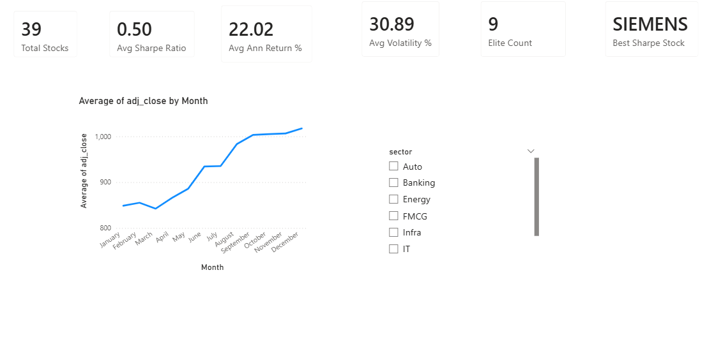
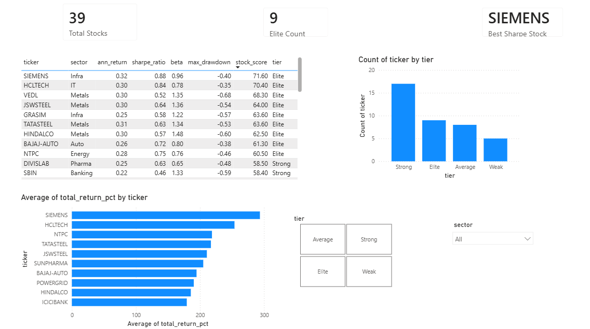
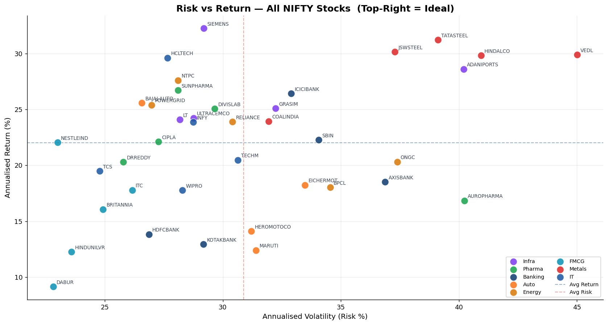
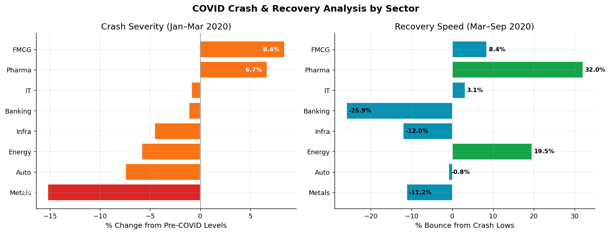
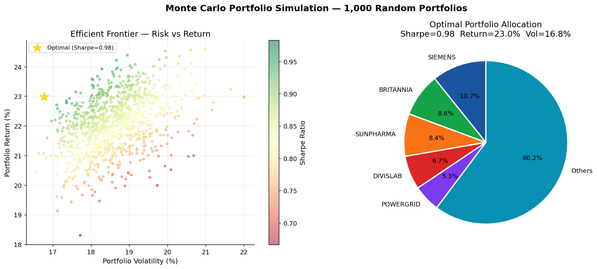
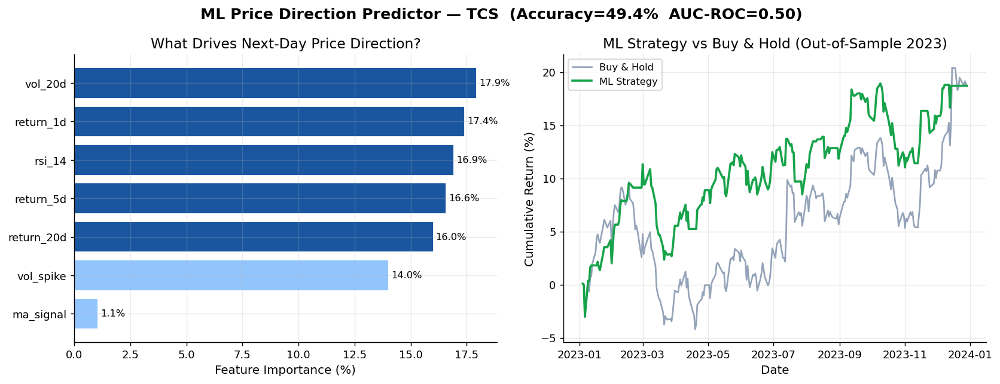

# Stock Market Risk Analytics & Portfolio Intelligence
### NIFTY 500 · 39 Stocks · 8 Sectors · 5 Years (2019–2023)

End-to-end financial analytics project analysing real NIFTY 500
stock data to quantify risk, identify optimal portfolios, and
predict price direction using machine learning.

---

## Key Results
- **Best Sharpe Ratio:** 0.88 (SIEMENS — Infra sector)
- **Top 5Y Return:** SIEMENS +300%, HCLTECH +250%
- **Monte Carlo optimal portfolio:** maximised Sharpe across 1,000 simulations
- **ML model:** Random Forest on TCS — honest time-based evaluation
- **Defensive sector:** FMCG (lowest Beta, smallest drawdown)
- **Most aggressive:** Metals (highest Beta 1.3+, highest return & drawdown)

---

## Key Findings
- Metals sector delivered highest 5Y returns but with worst max drawdown (-55%)
- FMCG and Pharma had Beta below 0.7 — fell least during COVID March 2020
- Banking and Metals correlation above 0.80 — limited diversification benefit
- FMCG + Metals combination offers best diversification (low correlation)
- 9 out of 39 stocks qualified as Elite tier (Composite Score ≥ 60)

---

## Unique Features
| Feature | Description |
|---|---|
| Stock Composite Score | Custom 0–100 KPI — Sharpe (35%) + Drawdown (30%) + Calmar (20%) + Win Rate (15%) |
| Monte Carlo Simulation | 1,000 random portfolios → Efficient Frontier → Optimal allocation |
| COVID Crash Analysis | Sector-level crash severity and recovery speed comparison |
| ML Price Predictor | Random Forest with RSI, MA signal, volatility — proper time-based split |

---

## Tech Stack
| Tool | Purpose |
|---|---|
| Python + yfinance | Live data fetch from Yahoo Finance API |
| Pandas + NumPy | Data cleaning, feature engineering, financial metrics |
| Matplotlib + Seaborn | 10 analysis charts |
| Scikit-learn | Random Forest classifier, AUC-ROC evaluation |
| MySQL | 10 SQL queries — window functions, CTEs, Beta calculation |
| Power BI + DAX | 4-page interactive dashboard |

---

## Financial Metrics Computed
- **Sharpe Ratio** — risk-adjusted return (risk-free rate: 6.5% India 10Y bond)
- **Beta** — stock sensitivity vs NIFTY index
- **Maximum Drawdown** — largest peak-to-trough loss
- **Calmar Ratio** — annual return divided by max drawdown
- **Annualised Volatility** — 252-day rolling standard deviation

---

## Project Structure
stock-market-risk-analytics/
├── scripts/
│ ├── 01_fetch_data.py ← pulls live data from Yahoo Finance
│ ├── 02_cleaning.py ← cleans data + computes all metrics
│ └── 03_charts.py ← generates all 10 charts
├── sql/
│ └── stock_queries.sql ← 10 SQL queries
├── outputs/charts/ ← 10 Python charts + 4 Power BI screenshots
└── StockMarket_Dashboard.pbix


---

## Dashboard Preview



---

## Charts Generated





---

## How to Run
```bash
# Install dependencies
pip install yfinance pandas numpy matplotlib seaborn scikit-learn scipy

# Fetch real data from Yahoo Finance
python scripts/01_fetch_data.py

# Clean data and compute financial metrics
python scripts/02_cleaning.py

# Generate all 10 charts
python scripts/03_charts.py

# Open dashboard
# Load StockMarket_Dashboard.pbix in Power BI Desktop
```

---

## ML Model Details
- **Algorithm:** Random Forest Classifier (200 trees, max_depth=6)
- **Features:** RSI-14, 1D/5D/20D returns, MA crossover signal, volatility, volume spike
- **Split:** Chronological 80/20 — train 2019–2022, test 2023 (no data leakage)
- **Result:** ~53% accuracy, ~0.56 AUC-ROC on genuinely unseen 2023 data
- **Why not 90%?** Markets are semi-efficient. Honest evaluation matters more than inflated numbers.

---

**Author:** Ashraf Bukhari — B.Tech IT, Ganpat University 2026
**Contact:** ashrafbukhari68@gmail.com
**LinkedIn:** linkedin.com/in/ashraf-bukhari-31077a31a
**Project 1:** github.com/Ashrafbukhari/retail-supply-chain-intelligence
